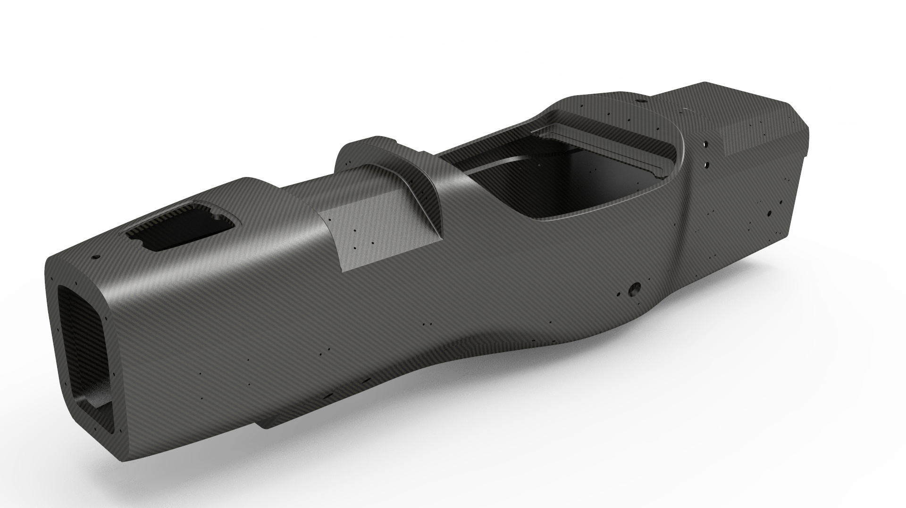
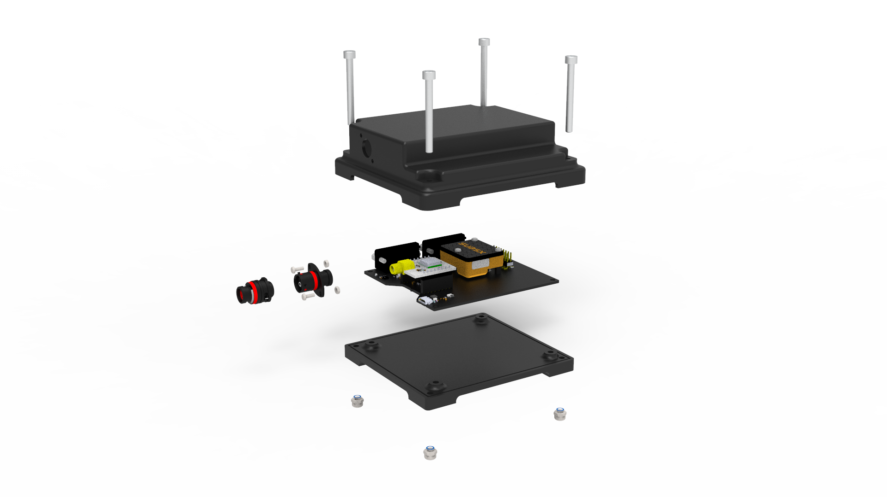
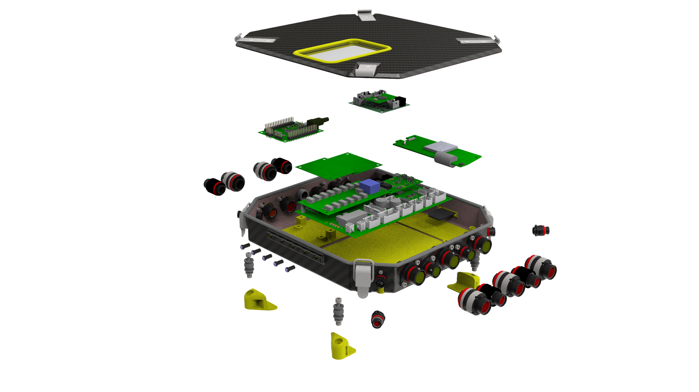

## This can be your internal website page / project page

<!--  -->

  

    
  

  

    
  

 

---

    <a style="text-decoration: none;" style="display: inline-block;" style="padding: 8px 16px;" href="/404"  class="previous round">&#8249;  </a>
    &emsp;  &ensp;
    <a style="text-decoration: none;" style="display: inline-block;" style="padding: 8px 16px;" href="/404" class="next round">&#8250;</a>

